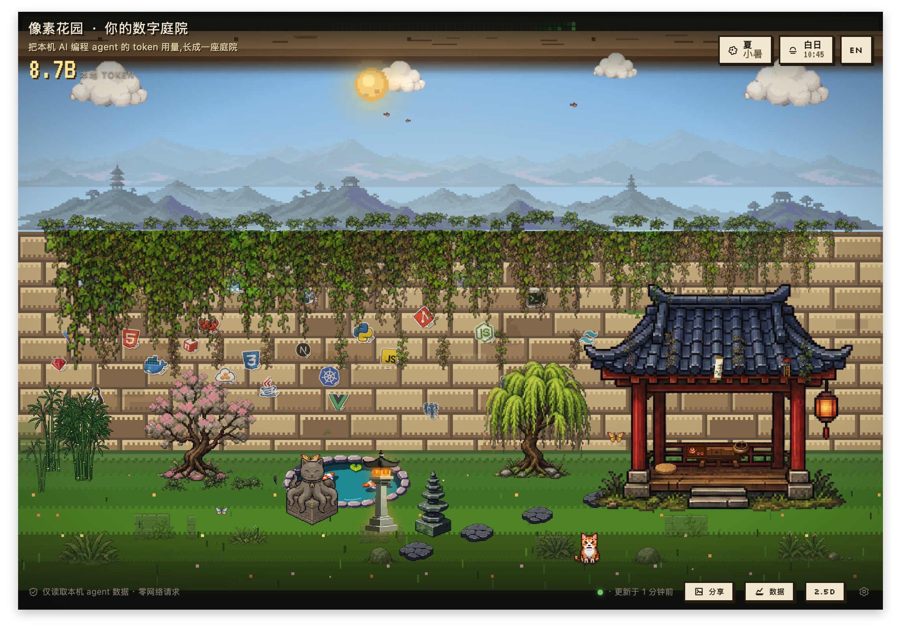

# Pixel Agent Garden

[](LICENSE) · [🔒 100% local — verify it yourself](PRIVACY.md)

Languages: [English](#english) | [中文](#中文)

## English

A private desktop garden grown from your local AI agent activity.


### Visual modes

The app includes two local-only visual modes. The 2.5D courtyard is the default
ambient view for staying open on the desktop. The Wall view keeps the original
vine-wall language visible: project growth hangs from the wall edge, programming
stickers mark the tools and ecosystems around the garden, and the brick surface
works as a direct map of local agent activity.



Pixel Agent Garden reads local agent traces from disk, normalizes them into one
Rust event model, and renders project growth as an ambient pixel courtyard. Each
project becomes a vine; tokens, sessions, cache activity, and recent work shape
the wall, unlock courtyard objects, and add seasonal details. It sends no
telemetry, makes no scan/render network calls, and never writes to source agent
directories.

The current app is a full-window Tauri garden with a tabbed local data drawer,
bilingual UI, tray watcher, share drawer, weekly recap and year-review cards,
one-click local Postcard export, and a small "While you were away" summary when
projects grow between visits.

## Why

- **Private by design** — only local files are read; source agent directories
  are treated as read-only, and scan/render paths do not call remote services.
- **One model, many agents** — Claude Code, Claude Cowork, Codex, and a manual
  JSONL escape hatch all normalize into the same `AgentEvent`.
- **A garden, not a dashboard** — an ambient, glanceable view of where your
  agent time actually goes.

## Highlights

- **Living pixel garden** — local time, season, tokens, sessions, cache ratio,
  and recent activity all affect the scene.
- **Agent nursery** — an opt-in garden layer shows which local agent sources
  tended the garden recently, using the same local source-token rollups as the
  Composition tab.
- **Insight without telemetry** — rank projects, distinguish same-name folders,
  inspect local cost estimates, and export daily project-token data without a
  server.
- **Share artifacts** — export the current scene to a local PNG, open a Monday
  weekly recap card, or generate a year-to-date review card entirely from local
  summaries.
- **Return diff** — when you come back, the garden shows what grew since the
  last viewed snapshot.
- **CLI + desktop** — use the terminal wall and usage commands, or keep the
  Tauri app open with tray actions and live watcher updates.

## Install

Grab the latest build for your platform from the
[Releases page](https://github.com/DipsySu/pixel-agent-garden/releases):
Code signing status and release signing rules are documented in the
[Code Signing Policy](docs/code-signing-policy.md).

- **macOS** — the `.dmg` build attached to the release. Builds are currently
  **unsigned**, so on first launch right-click the app and choose _Open_ (or
  allow it under System Settings → Privacy & Security). See
  [Unsigned Install Notes](docs/unsigned-installs.md).
- **Linux** — `.AppImage` (make it executable: `chmod +x *.AppImage`) or the
  `.deb` package.
- **Windows** — the NSIS `*-setup.exe` installer. SmartScreen may warn on an
  unsigned installer; choose _More info → Run anyway_. See
  [Unsigned Install Notes](docs/unsigned-installs.md).

On first run the app scans your local agent directories and writes a cache to
`~/.local-agent-garden/`. The tray icon gives you _Scan Now_, show/hide, open
settings, and quit.

## Adapters

- `claude-code`: `~/.claude/projects/**/*.jsonl`
- `claude-cowork`: Claude Desktop Cowork local agent sessions under
  `~/Library/Application Support/Claude/local-agent-mode-sessions/`
- `codex`: `~/.codex/state_5.sqlite`, `~/.codex/session_index.jsonl`, and
  Codex rollout JSONL files when present
- `manual-jsonl`: optional local JSONL import for agents before native adapters
  exist

## Build from source

Install Rust 1.85+ and the Tauri 2 CLI:

```bash
cargo install tauri-cli --version "^2.0" --locked
```

Run the desktop app in development mode:

```bash
cd crates/tauri-app
cargo tauri dev
```

Produce distributable bundles for the current platform:

```bash
cd crates/tauri-app
cargo tauri build      # artifacts under target/release/bundle/
```

Use the Rust CLI directly:

```bash
cargo run --release -p local-agent-garden-cli -- adapters
cargo run --release -p local-agent-garden-cli -- adapters --json --watch-paths
cargo run --release -p local-agent-garden-cli -- doctor
cargo run --release -p local-agent-garden-cli -- doctor --json
cargo run --release -p local-agent-garden-cli -- scan --out ~/.local-agent-garden/events.json
cargo run --release -p local-agent-garden-cli -- projects
cargo run --release -p local-agent-garden-cli -- inspect --project demo-pay
cargo run --release -p local-agent-garden-cli -- usage
cargo run --release -p local-agent-garden-cli -- usage --date yesterday --json
cargo run --release -p local-agent-garden-cli -- garden
cargo run --release -p local-agent-garden-cli -- export-web --out web/data/garden-summary.json
```

Preview the web garden fallback in a browser (reads
`web/data/garden-summary.json`, no Tauri runtime):

```bash
python3 -m http.server 8765
# then open http://127.0.0.1:8765/web/index.html
```

If a local install behaves unexpectedly, run:

```bash
agent-garden doctor
agent-garden doctor --json
```

The doctor report checks only local state: state-dir writability,
`settings.toml`, `prices.json`, `events.json`, `rings.json`, and adapter
discovery. It does not scan source logs or call the network. Home-directory
paths are shortened to `~`, but review the report before sharing it.

## Manual JSONL Format

Use this for Cursor, Aider, Gemini CLI, or any source before a native adapter is
added:

```json
{"source":"aider","timestamp":"2026-05-27T09:00:00Z","project_path":"/repo","session_id":"s1","input_tokens":1200,"output_tokens":400,"tool_calls":3}
```

Every field is optional except `source` and `timestamp`; unknown fields are
ignored.

Native adapter contributions should start with
[`docs/23-adapter-development-guide.md`](docs/23-adapter-development-guide.md).
When requesting support for a new agent, attach redacted local path patterns
and the output of `agent-garden adapters --json --watch-paths`.

## Architecture

```text
local agent files
      |
      v
crates/core/src/adapters/*  ->  AgentEvent
      |
      v
crates/core/src/aggregate.rs  ->  GardenSummary
      |
      +--> crates/cli/src/ascii_wall.rs
      |
      +--> Tauri commands / watcher
      |
      +--> web/data/garden-summary.json -> web/index.html
```

The important boundary is the adapter contract: UI code never knows whether an
event came from Claude Code, Claude Cowork, Codex, or a future local agent. See
[`docs/architecture.md`](docs/architecture.md) and the
[runtime spec](docs/11-tauri-rust-rewrite-spec.md) for details.

## Privacy

- No network requests at scan or render time.
- No analytics, no telemetry.
- Source agent directories are read-only; the only writes go to
  `~/.local-agent-garden/`.
- Postcard export writes a local PNG only; it does not upload or call a remote
  service.

## Status

Rust is the only runtime for product code. `assets/` is the canonical sprite
source; `web/assets/` is generated by the Tauri build script and is not
committed. Locale-aware UI, Garden Postcard, return diff, tray/menu, watcher,
CI, and release workflows are in place. See [`CHANGELOG.md`](CHANGELOG.md) for
recent work.

## 中文

一个由本机 AI agent 活动长出来的私有桌面花园。


### 视觉模式

应用包含两种完全本地的视觉模式。2.5D 庭院是默认的 ambient view，适合常驻桌面；
Wall 视图保留最初的藤蔓墙语言：项目增长从墙沿垂下，编程贴纸标记花园里的工具和技术生态，
砖墙表面则像一张更直接的本地 agent 活动地图。


Pixel Agent Garden 从磁盘读取本机 agent 记录，把它们规范化成同一个 Rust
事件模型，然后渲染成一个安静的像素庭院。每个项目是一根藤蔓；token、session、
cache 活动和近期活跃度会影响墙面、生长状态、庭院物件和季节细节。它不做遥测，
scan/render 路径不发网络请求，也不会写入源 agent 目录。

当前 app 已经是全窗口 Tauri 花园：包含 tabbed 本地数据抽屉、双语 UI、托盘 watcher、
分享抽屉、上周周报卡、年度回顾卡、一键本地导出 Garden Postcard，以及当项目在两次查看之间增长时出现的
“你不在的时候”摘要。

### 为什么做

- **隐私优先** — 只读取本地文件；源 agent 目录只读；scan/render 路径不会访问远程服务。
- **一个模型，多个 agent** — Claude Code、Claude Cowork、Codex，以及 manual JSONL
  入口都会归一化成同一个 `AgentEvent`。
- **花园，不是仪表盘** — 它是一个安静、可瞥一眼的空间，用来看到你的 agent 时间流向哪里。

### 亮点

- **会生长的像素花园** — 本地时间、季节、token、session、cache ratio 和近期活跃度
  都会影响画面。
- **Agent 苗圃** — 可选开启的庭院层,用和“构成”页相同的本机 source-token
  数据展示最近是哪类 agent 在照料庭院。
- **本地 Insight** — 排名项目、区分同名目录、查看本地成本估算，并导出按项目拆分的每日 token 数据。
- **分享产物** — 把当前场景导出成本地 PNG，生成完全来自本机 summary 的周一回顾卡，
  或导出 year-to-date 年度回顾卡。
- **回来摘要** — 再次打开时，只在项目增长后显示“你不在的时候”变化。
- **CLI + 桌面端** — 可以用终端 ASCII 墙和 usage 命令，也可以常驻 Tauri app，
  通过托盘和 watcher 自动更新。

### 安装

从 [Releases 页面](https://github.com/DipsySu/pixel-agent-garden/releases)
下载对应平台的最新构建：
代码签名状态和 release 签名规则见
[Code Signing Policy](docs/code-signing-policy.md)。

- **macOS** — 下载 release 附带的 `.dmg`。当前构建还没有签名；首次启动时右键 app
  选择 _Open_，或在 System Settings → Privacy & Security 里允许打开。详见
  [未签名安装说明](docs/unsigned-installs.md)。
- **Linux** — 下载 `.AppImage`（先执行 `chmod +x *.AppImage`）或 `.deb` 包。
- **Windows** — 下载 NSIS `*-setup.exe` 安装器。未签名安装器可能触发 SmartScreen；
  如果信任该 release，选择 _More info → Run anyway_。详见
  [未签名安装说明](docs/unsigned-installs.md)。

首次运行时，应用会扫描本地 agent 目录，并把缓存写到 `~/.local-agent-garden/`。
托盘菜单提供 _Scan Now_、显示/隐藏窗口、打开设置和退出。

### 适配器

- `claude-code`: `~/.claude/projects/**/*.jsonl`
- `claude-cowork`: Claude Desktop Cowork 本地 agent sessions，
  位于 `~/Library/Application Support/Claude/local-agent-mode-sessions/`
- `codex`: `~/.codex/state_5.sqlite`、`~/.codex/session_index.jsonl`，
  以及存在时的 Codex rollout JSONL 文件
- `manual-jsonl`: 在原生 adapter 支持之前，用于 Cursor、Aider、Gemini CLI 等来源的本地 JSONL 入口

### 从源码构建

安装 Rust 1.85+ 和 Tauri 2 CLI：

```bash
cargo install tauri-cli --version "^2.0" --locked
```

运行桌面开发版：

```bash
cd crates/tauri-app
cargo tauri dev
```

为当前平台生成安装包：

```bash
cd crates/tauri-app
cargo tauri build      # 产物在 target/release/bundle/
```

直接使用 Rust CLI：

```bash
cargo run --release -p local-agent-garden-cli -- adapters
cargo run --release -p local-agent-garden-cli -- adapters --json --watch-paths
cargo run --release -p local-agent-garden-cli -- doctor
cargo run --release -p local-agent-garden-cli -- doctor --json
cargo run --release -p local-agent-garden-cli -- scan --out ~/.local-agent-garden/events.json
cargo run --release -p local-agent-garden-cli -- projects
cargo run --release -p local-agent-garden-cli -- inspect --project demo-pay
cargo run --release -p local-agent-garden-cli -- usage
cargo run --release -p local-agent-garden-cli -- usage --date yesterday --json
cargo run --release -p local-agent-garden-cli -- garden
cargo run --release -p local-agent-garden-cli -- export-web --out web/data/garden-summary.json
```

用浏览器预览 web fallback（读取 `web/data/garden-summary.json`，不依赖 Tauri runtime）：

```bash
python3 -m http.server 8765
# 然后打开 http://127.0.0.1:8765/web/index.html
```

如果本地安装状态异常，先运行：

```bash
agent-garden doctor
agent-garden doctor --json
```

doctor 报告只检查本地状态：state 目录是否可写、`settings.toml`、
`prices.json`、`events.json`、`rings.json` 和 adapter discovery。它不会扫描源日志，
也不会访问网络。home 目录路径会缩短成 `~`，但分享前仍应自行复核。

### Manual JSONL 格式

Cursor、Aider、Gemini CLI 或任何还没有原生 adapter 的来源，都可以先用这个格式接入：

```json
{"source":"aider","timestamp":"2026-05-27T09:00:00Z","project_path":"/repo","session_id":"s1","input_tokens":1200,"output_tokens":400,"tool_calls":3}
```

除了 `source` 和 `timestamp`，其他字段都是可选的；未知字段会被忽略。

原生 adapter 贡献从
[`docs/23-adapter-development-guide.md`](docs/23-adapter-development-guide.md)
开始。请求支持新 agent 时，请附上脱敏后的本地路径模式，以及
`agent-garden adapters --json --watch-paths` 输出。

### 架构

```text
local agent files
      |
      v
crates/core/src/adapters/*  ->  AgentEvent
      |
      v
crates/core/src/aggregate.rs  ->  GardenSummary
      |
      +--> crates/cli/src/ascii_wall.rs
      |
      +--> Tauri commands / watcher
      |
      +--> web/data/garden-summary.json -> web/index.html
```

最重要的边界是 adapter contract：UI 不知道事件来自 Claude Code、Claude Cowork、
Codex，还是未来的新本地 agent。详情见 [`docs/architecture.md`](docs/architecture.md)
和 [runtime spec](docs/11-tauri-rust-rewrite-spec.md)。

### 隐私

- scan 或 render 时不发网络请求。
- 没有 analytics，没有 telemetry。
- 源 agent 目录只读；唯一写入位置是 `~/.local-agent-garden/`。
- Postcard 只写出本地 PNG，不上传，也不调用远程服务。

### 状态

Rust 是唯一产品运行时。`assets/` 是 sprite 源资产目录；`web/assets/` 由 Tauri
build script 生成，不提交进仓库。双语 UI、Garden Postcard、回来摘要、托盘/菜单、
watcher、CI 和 release workflows 都已就位。最近变更见 [`CHANGELOG.md`](CHANGELOG.md)。
