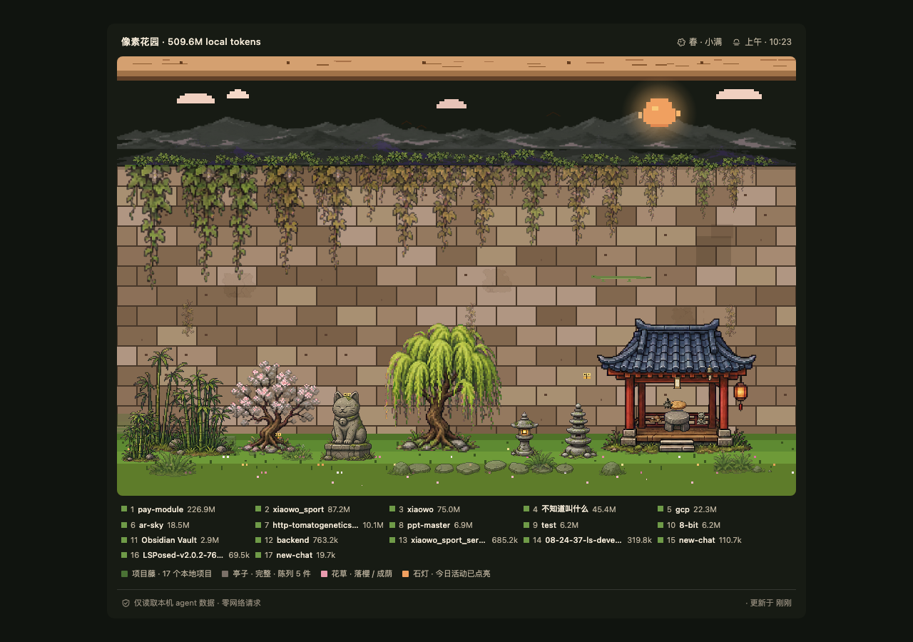

# Pixel Agent Garden

[](LICENSE) · [🔒 100% local — verify it yourself](PRIVACY.md)

Languages: [English](#english) | [中文](#中文)

## English

A private local garden grown from your AI agent activity.



Pixel Agent Garden reads local agent traces only, normalizes them into one Rust
event model, and renders project growth in both a terminal wall and a Tauri
desktop garden. Each project becomes a vine; tokens, sessions, and recent
activity drive the size of the vines and unlock courtyard objects, pavilion
trinkets, and seasonal touches. It sends no telemetry and makes no network
calls.

> The scene changes with the local time of day (day / dusk / night) and the
> season (spring petals, summer-night fireflies, autumn maple leaves, winter
> snow). _A four-season capture lives in `docs/images/` — drop a GIF in here
> and swap the hero image above when you have one._

## Why

- **Private by design** — only local files are read; source agent directories
  are treated as read-only and the app never reaches the network.
- **One model, many agents** — Claude Code, Claude Cowork, Codex, and a manual
  JSONL escape hatch all normalize into the same `AgentEvent`.
- **A garden, not a dashboard** — an ambient, glanceable view of where your
  agent time actually goes.

## Install

Grab the latest build for your platform from the
[Releases page](https://github.com/DipsySu/pixel-agent-garden/releases):

- **macOS** — the `.dmg` build attached to the release. Builds are currently
  **unsigned**, so on first launch right-click the app and choose _Open_ (or
  allow it under System Settings → Privacy & Security).
- **Linux** — `.AppImage` (make it executable: `chmod +x *.AppImage`) or the
  `.deb` package.
- **Windows** — the NSIS `*-setup.exe` installer. SmartScreen may warn on an
  unsigned installer; choose _More info → Run anyway_.

On first run the app scans your local agent directories and writes a cache to
`~/.local-agent-garden/`. The tray icon gives you _Scan Now_, show/hide, open
settings, and quit.

## Adapters

- `claude-code`: `~/.claude/projects/**/*.jsonl`
- `claude-cowork`: Claude Desktop Cowork local agent sessions under
  `~/Library/Application Support/Claude/local-agent-mode-sessions/`
- `codex`: `~/.codex/state_5.sqlite`, `~/.codex/session_index.jsonl`, and
  Codex rollout JSONL files when present
- `manual-jsonl`: optional local JSONL import for agents before native adapters
  exist

## Build from source

Install Rust 1.85+ and the Tauri 2 CLI:

```bash
cargo install tauri-cli --version "^2.0" --locked
```

Run the desktop app in development mode:

```bash
cd crates/tauri-app
cargo tauri dev
```

Produce distributable bundles for the current platform:

```bash
cd crates/tauri-app
cargo tauri build      # artifacts under target/release/bundle/
```

Use the Rust CLI directly:

```bash
cargo run --release -p local-agent-garden-cli -- adapters
cargo run --release -p local-agent-garden-cli -- scan --out ~/.local-agent-garden/events.json
cargo run --release -p local-agent-garden-cli -- projects
cargo run --release -p local-agent-garden-cli -- inspect --project pay-module
cargo run --release -p local-agent-garden-cli -- usage
cargo run --release -p local-agent-garden-cli -- usage --date yesterday --json
cargo run --release -p local-agent-garden-cli -- garden
cargo run --release -p local-agent-garden-cli -- export-web --out web/data/garden-summary.json
```

Preview the web garden fallback in a browser (reads
`web/data/garden-summary.json`, no Tauri runtime):

```bash
python3 -m http.server 8765
# then open http://127.0.0.1:8765/web/index.html
```

## Manual JSONL Format

Use this for Cursor, Aider, Gemini CLI, or any source before a native adapter is
added:

```json
{"source":"aider","timestamp":"2026-05-27T09:00:00Z","project_path":"/repo","session_id":"s1","input_tokens":1200,"output_tokens":400,"tool_calls":3}
```

Every field is optional except `source` and `timestamp`; unknown fields are
ignored.

## Architecture

```text
local agent files
      |
      v
crates/core/src/adapters/*  ->  AgentEvent
      |
      v
crates/core/src/aggregate.rs  ->  GardenSummary
      |
      +--> crates/cli/src/ascii_wall.rs
      |
      +--> Tauri commands / watcher
      |
      +--> web/data/garden-summary.json -> web/index.html
```

The important boundary is the adapter contract: UI code never knows whether an
event came from Claude Code, Claude Cowork, Codex, or a future local agent. See
[`docs/architecture.md`](docs/architecture.md) and the
[runtime spec](docs/11-tauri-rust-rewrite-spec.md) for details.

## Privacy

- No network requests at scan or render time.
- No analytics, no telemetry.
- Source agent directories are read-only; the only writes go to
  `~/.local-agent-garden/`.

## Status

Rust is the only runtime for product code. `assets/` is the canonical sprite
source; `web/assets/` is generated by the Tauri build script and is not
committed. See [`CHANGELOG.md`](CHANGELOG.md) for recent work.

## 中文

一个由本机 AI agent 活动长出来的私有数字花园。


Pixel Agent Garden 只读取本机 agent 记录，把它们规范化成同一个 Rust
事件模型，然后渲染成终端 ASCII 墙和 Tauri 桌面像素花园。每个项目是一根藤蔓；
token、session 和近期活跃度会驱动藤蔓大小，并解锁庭院物件、亭子陈列和季节细节。
它不做遥测，也不发任何网络请求。

> 场景会跟随本地时间和季节变化：白天 / 黄昏 / 夜晚，春天花瓣、夏夜萤火虫、
> 秋天枫叶、冬天雪花。后续可以把四季截图或 GIF 放进 `docs/images/` 作为展示图。

### 为什么做

- **隐私优先** — 只读取本地文件；源 agent 目录只读；应用不会访问网络。
- **一个模型，多个 agent** — Claude Code、Claude Cowork、Codex，以及 manual JSONL
  入口都会归一化成同一个 `AgentEvent`。
- **花园，不是仪表盘** — 它是一个安静、可瞥一眼的空间，用来看到你的 agent 时间流向哪里。

### 安装

从 [Releases 页面](https://github.com/DipsySu/pixel-agent-garden/releases)
下载对应平台的最新构建：

- **macOS** — 下载 release 附带的 `.dmg`。当前构建还没有签名；首次启动时右键 app
  选择 _Open_，或在 System Settings → Privacy & Security 里允许打开。
- **Linux** — 下载 `.AppImage`（先执行 `chmod +x *.AppImage`）或 `.deb` 包。
- **Windows** — 下载 NSIS `*-setup.exe` 安装器。未签名安装器可能触发 SmartScreen；
  如果信任该 release，选择 _More info → Run anyway_。

首次运行时，应用会扫描本地 agent 目录，并把缓存写到 `~/.local-agent-garden/`。
托盘菜单提供 _Scan Now_、显示/隐藏窗口、打开设置和退出。

### 适配器

- `claude-code`: `~/.claude/projects/**/*.jsonl`
- `claude-cowork`: Claude Desktop Cowork 本地 agent sessions，
  位于 `~/Library/Application Support/Claude/local-agent-mode-sessions/`
- `codex`: `~/.codex/state_5.sqlite`、`~/.codex/session_index.jsonl`，
  以及存在时的 Codex rollout JSONL 文件
- `manual-jsonl`: 在原生 adapter 支持之前，用于 Cursor、Aider、Gemini CLI 等来源的本地 JSONL 入口

### 从源码构建

安装 Rust 1.85+ 和 Tauri 2 CLI：

```bash
cargo install tauri-cli --version "^2.0" --locked
```

运行桌面开发版：

```bash
cd crates/tauri-app
cargo tauri dev
```

为当前平台生成安装包：

```bash
cd crates/tauri-app
cargo tauri build      # 产物在 target/release/bundle/
```

直接使用 Rust CLI：

```bash
cargo run --release -p local-agent-garden-cli -- adapters
cargo run --release -p local-agent-garden-cli -- scan --out ~/.local-agent-garden/events.json
cargo run --release -p local-agent-garden-cli -- projects
cargo run --release -p local-agent-garden-cli -- inspect --project pay-module
cargo run --release -p local-agent-garden-cli -- usage
cargo run --release -p local-agent-garden-cli -- usage --date yesterday --json
cargo run --release -p local-agent-garden-cli -- garden
cargo run --release -p local-agent-garden-cli -- export-web --out web/data/garden-summary.json
```

用浏览器预览 web fallback（读取 `web/data/garden-summary.json`，不依赖 Tauri runtime）：

```bash
python3 -m http.server 8765
# 然后打开 http://127.0.0.1:8765/web/index.html
```

### Manual JSONL 格式

Cursor、Aider、Gemini CLI 或任何还没有原生 adapter 的来源，都可以先用这个格式接入：

```json
{"source":"aider","timestamp":"2026-05-27T09:00:00Z","project_path":"/repo","session_id":"s1","input_tokens":1200,"output_tokens":400,"tool_calls":3}
```

除了 `source` 和 `timestamp`，其他字段都是可选的；未知字段会被忽略。

### 架构

```text
local agent files
      |
      v
crates/core/src/adapters/*  ->  AgentEvent
      |
      v
crates/core/src/aggregate.rs  ->  GardenSummary
      |
      +--> crates/cli/src/ascii_wall.rs
      |
      +--> Tauri commands / watcher
      |
      +--> web/data/garden-summary.json -> web/index.html
```

最重要的边界是 adapter contract：UI 不知道事件来自 Claude Code、Claude Cowork、
Codex，还是未来的新本地 agent。详情见 [`docs/architecture.md`](docs/architecture.md)
和 [runtime spec](docs/11-tauri-rust-rewrite-spec.md)。

### 隐私

- scan 或 render 时不发网络请求。
- 没有 analytics，没有 telemetry。
- 源 agent 目录只读；唯一写入位置是 `~/.local-agent-garden/`。

### 状态

Rust 是唯一产品运行时。`assets/` 是 sprite 源资产目录；`web/assets/` 由 Tauri
build script 生成，不提交进仓库。最近变更见 [`CHANGELOG.md`](CHANGELOG.md)。
